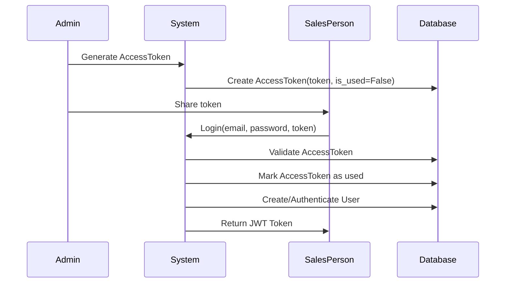

# 📊 Entity Relationship Diagram (ERD) - Inventory Management System

## 🔗 Database Schema Visualization

```mermaid
erDiagram
    User {
        id BIGINT PK
        email VARCHAR(254) UK "Unique email address"
        password VARCHAR(128) "Hashed password"
        is_active BOOLEAN "Account status"
        is_admin BOOLEAN "Admin privileges"
        is_salesperson BOOLEAN "Sales privileges"
        access_token VARCHAR(100) "API access token"
        last_login DATETIME "Last login timestamp"
        date_joined DATETIME "Account creation date"
    }

    Product {
        id BIGINT PK
        name VARCHAR(255) "Product name"
        sku VARCHAR(100) UK "Stock Keeping Unit"
        price DECIMAL(10,2) "Product price"
        quantity INTEGER "Stock quantity"
        category VARCHAR(100) "Product category"
        best_before DATE "Expiration date"
        discontinued BOOLEAN "Product status"
        low_stock_threshold INTEGER "Min stock alert level"
    }

    Customer {
        id BIGINT PK
        name VARCHAR(255) "Customer name"
        email EMAIL "Contact email"
        phone VARCHAR(50) "Phone number"
        address TEXT "Customer address"
        active BOOLEAN "Customer status"
        join_date DATE "Registration date"
    }

    Sale {
        id BIGINT PK
        user_id BIGINT FK "Sales person"
        product_id BIGINT FK "Product sold"
        customer_id BIGINT FK "Customer (nullable)"
        date DATE "Sale date"
        amount DECIMAL(10,2) "Sale amount"
        status VARCHAR(50) "Sale status"
    }

    AccessToken {
        id BIGINT PK
        token VARCHAR(10) UK "Unique token"
        created_at DATETIME "Creation timestamp"
        is_used BOOLEAN "Usage status"
    }

    Notification {
        id BIGINT PK
        message TEXT "Notification content"
        type VARCHAR(10) "info|warning|error"
        created_at DATETIME "Creation timestamp"
    }

    AuditLog {
        id BIGINT PK
        type VARCHAR(50) "Action type"
        user VARCHAR(100) "User identifier"
        action TEXT "Action description"
        timestamp DATETIME "Action timestamp"
        ip_address INET "User IP address"
        details TEXT "Additional details"
    }

    SystemSettings {
        id BIGINT PK
        currency VARCHAR(10) "Currency symbol"
        currency_code VARCHAR(10) "ISO currency code"
        tax_rate DECIMAL(5,2) "Tax percentage"
        discount_rules JSON "Discount configuration"
        features JSON "Feature toggles"
        working_hours JSON "Business hours"
        notifications JSON "Notification settings"
    }

    %% Relationships
    User ||--o{ Sale : "creates"
    Product ||--o{ Sale : "sold_in"
    Customer ||--o{ Sale : "purchases"
    
    %% Notes on relationships
    Sale }o--|| User : "Each sale has one salesperson"
    Sale }o--|| Product : "Each sale contains one product"
    Sale }o--o| Customer : "Sale may have associated customer"
```

## 📋 Table Relationships Summary

### **Primary Relationships:**
1. **User → Sale** (One-to-Many): Each user can create multiple sales
2. **Product → Sale** (One-to-Many): Each product can be sold multiple times
3. **Customer → Sale** (One-to-Many): Each customer can make multiple purchases

### **Key Constraints:**
- **User.email**: Unique constraint for authentication
- **Product.sku**: Unique stock keeping unit identifier
- **AccessToken.token**: Unique token for authentication
- **Sale.customer**: Nullable foreign key (walk-in customers)

### **Standalone Tables:**
- **AccessToken**: Independent token management
- **Notification**: System-wide notifications
- **AuditLog**: Activity tracking and compliance
- **SystemSettings**: Application configuration (singleton pattern)

## 🔐 Authentication Flow



## 📊 Data Types & Constraints

### **User Model:**
- **Primary Key**: Auto-increment BigInt
- **Email**: Unique, indexed for fast lookups
- **Password**: Django's built-in hashing (PBKDF2)
- **Roles**: Boolean flags for admin/salesperson
- **Token**: Nullable for API access

### **Product Model:**
- **SKU**: Unique identifier for inventory tracking
- **Price**: Decimal(10,2) for financial precision
- **Quantity**: Integer with low_stock_threshold alerts
- **Dates**: Date fields for expiration tracking

### **Sale Model:**
- **Foreign Keys**: Proper cascading relationships
- **Amount**: Decimal for financial accuracy
- **Customer**: Optional (SET_NULL for data retention)

### **System Tables:**
- **AuditLog**: Comprehensive activity tracking
- **Notifications**: Type-based message system
- **Settings**: JSON fields for flexible configuration

## 🎯 Database Design Principles

### ✅ **Normalization:**
- **3NF Compliance**: Eliminates data redundancy
- **Proper Foreign Keys**: Maintains referential integrity
- **Indexed Fields**: Optimized for common queries

### ✅ **Security:**
- **Password Hashing**: Django's secure password storage
- **Token-based Auth**: Secure API access control
- **Audit Trail**: Complete activity logging

### ✅ **Scalability:**
- **Indexed Keys**: Fast lookups and joins
- **JSON Fields**: Flexible configuration storage
- **Nullable FKs**: Handles edge cases gracefully

### ✅ **Business Logic:**
- **Stock Management**: Quantity tracking with alerts
- **Sales Tracking**: Complete transaction history
- **User Roles**: Proper permission separation
- **Customer Relations**: Optional customer association
